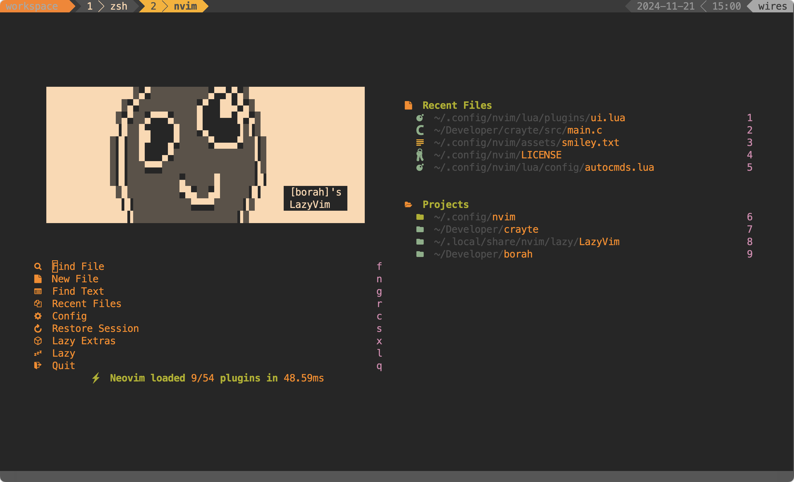

# 💤 \[borah]'s custom LazyVim


_A reproducible setup for my lazyvim config._

## Installation:

For UNIX based systems:

```
./installer.sh
```

## Prerequisites

- [neovim](https://github.com/neovim/neovim)
- [fzf](https://github.com/junegunn/fzf)
- [lazygit](https://github.com/jesseduffield/lazygit)

## References

- The starter template for [LazyVim](https://github.com/LazyVim/LazyVim).
- The [original LazyVim docs](https://lazyvim.github.io/).
- [devaslife's LazyVim config](https://github.com/craftzdog/dotfiles-public)
